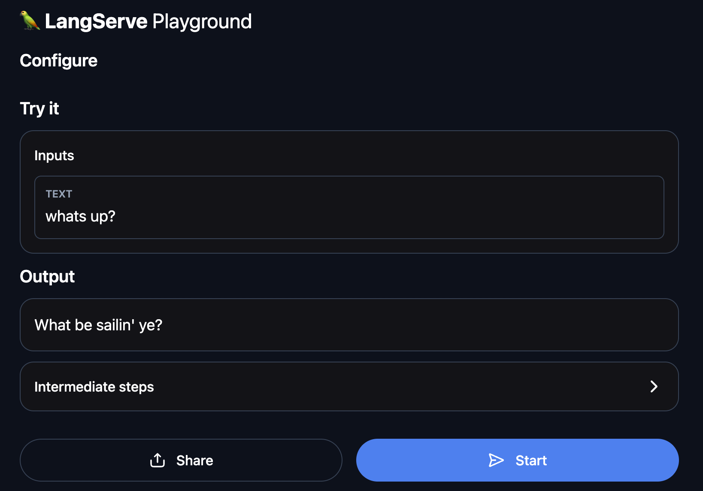
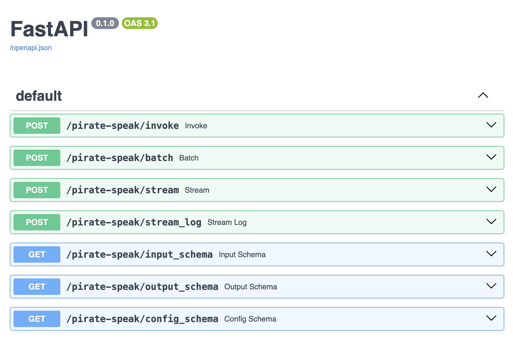

# LangChain Templates

LangChain Templates are the easiest and fastest way to build a production-ready LLM application.
These templates serve as a set of reference architectures for a wide variety of popular LLM use cases.
They are all in a standard format which make it easy to deploy them with [LangServe](https://github.com/langchain-ai/langserve).

🚩 We will be releasing a hosted version of LangServe for one-click deployments of LangChain applications. [Sign up here](https://airtable.com/app0hN6sd93QcKubv/shrAjst60xXa6quV2) to get on the waitlist.

## Quick Start

To use, first install the LangChain CLI.

```shell
pip install -U langchain-cli
```

Next, create a new LangChain project:

```shell
langchain app new my-app
```

This will create a new directory called `my-app` with two folders:

- `app`: This is where LangServe code will live
- `packages`: This is where your chains or agents will live

To pull in an existing template as a package, you first need to go into your new project:

```shell
cd my-app
```

And you can the add a template as a project.
In this getting started guide, we will add a simple `pirate-speak` project.
All this project does is convert user input into pirate speak.

```shell
langchain app add pirate-speak
```

This will pull in the specified template into `packages/pirate-speak`

You will then be prompted if you want to install it. 
This is the equivalent of running `pip install -e packages/pirate-speak`.
You should generally accept this (or run that same command afterwards).
We install it with `-e` so that if you modify the template at all (which you likely will) the changes are updated.

After that, it will ask you if you want to generate route code for this project.
This is code you need to add to your app to start using this chain.
If we accept, we will see the following code generated:

```shell
from pirate_speak.chain import chain as pirate_speak_chain

add_routes(app, pirate_speak_chain, path="/pirate-speak")
```

You can now edit the template you pulled down.
You can change the code files in `packages/pirate-speak` to use a different model, different prompt, different logic.
Note that the above code snippet always expects the final chain to be importable as `from pirate_speak.chain import chain`,
so you should either keep the structure of the package similar enough to respect that or be prepared to update that code snippet.

Once you have done as much of that as you want, it is 
In order to have LangServe use this project, you then need to modify `app/server.py`.
Specifically, you should add the above code snippet to `app/server.py` so that file looks like:

```python
from fastapi import FastAPI
from langserve import add_routes
from pirate_speak.chain import chain as pirate_speak_chain

app = FastAPI()

add_routes(app, pirate_speak_chain, path="/pirate-speak")
```

(Optional) Let's now configure LangSmith. 
LangSmith will help us trace, monitor and debug LangChain applications. 
You can sign up for LangSmith [here](https://smith.langchain.com/). 
If you don't have access, you can skip this section


```shell
export LANGCHAIN_TRACING_V2=true
export LANGCHAIN_API_KEY=<your-api-key>
export LANGCHAIN_PROJECT=<your-project>  # if not specified, defaults to "default"
```

For this particular application, we will use OpenAI as the LLM, so we need to export our OpenAI API key:

```shell
export OPENAI_API_KEY=sk-...
```

You can then spin up production-ready endpoints, along with a playground, by running:

```shell
langchain serve
```

This now gives a fully deployed LangServe application.
For example, you get a playground out-of-the-box at [http://127.0.0.1:8000/pirate-speak/playground/](http://127.0.0.1:8000/pirate-speak/playground/):



Access API documentation at [http://127.0.0.1:8000/docs](http://127.0.0.1:8000/docs)



Use the LangServe python or js SDK to interact with the API as if it were a regular [Runnable](https://python.langchain.com/docs/expression_language/).

```python
from langserve import RemoteRunnable

api = RemoteRunnable("http://127.0.0.1:8000/pirate-speak")
api.invoke({"text": "hi"})
```

That's it for the quick start!
You have successfully downloaded your first template and deployed it with LangServe.


## Additional Resources

### [Index of Templates](docs/INDEX.md)

Explore the many templates available to use - from advanced RAG to agents.

### [Contributing](docs/CONTRIBUTING.md)

Want to contribute your own template? It's pretty easy! These instructions walk through how to do that.

### [Launching LangServe from a Package](docs/LAUNCHING_PACKAGE.md)

You can also launch LangServe from a package directly (without having to create a new project).
These instructions cover how to do that.
